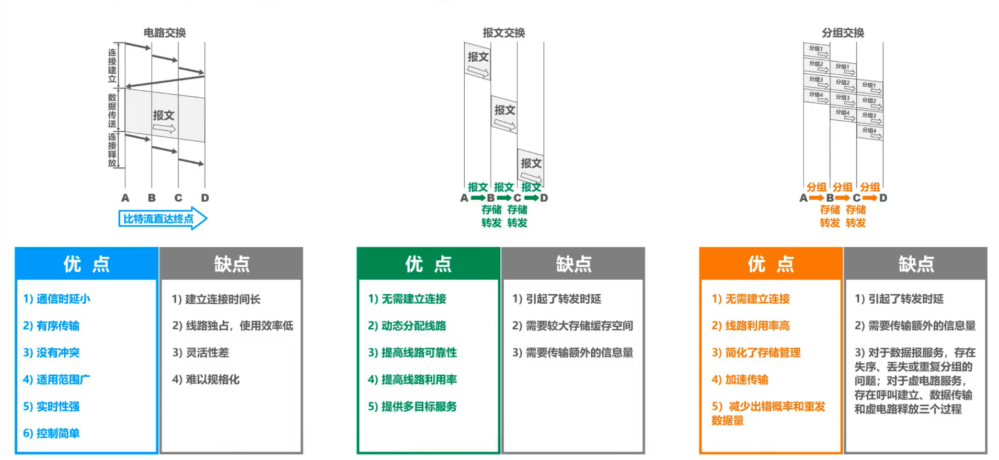
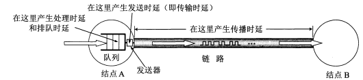
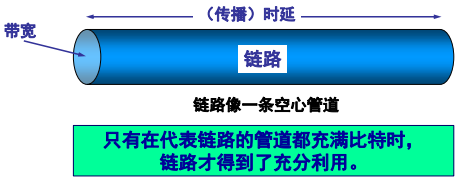
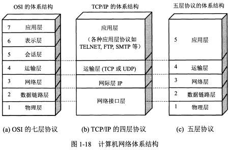
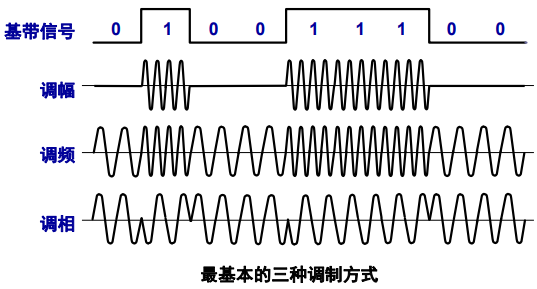
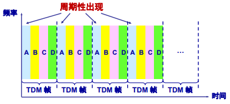
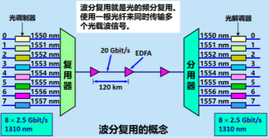
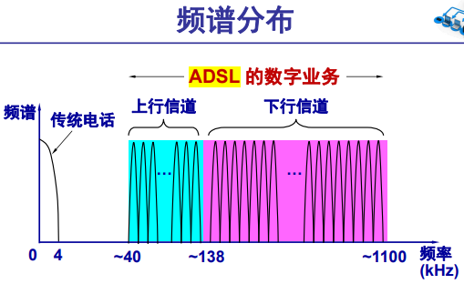
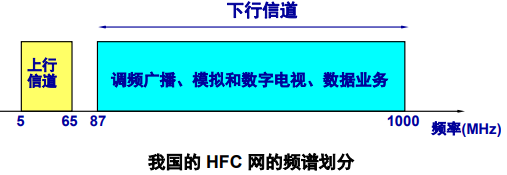
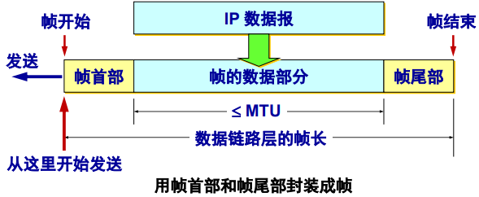

# 前言

1. 重点来源：人工智能和信息安全，感谢yq和zxq
2. 内容主要来源：课本、PPT（htq21年版）、[网上大佬笔记](https://github.com/BloothOfYouth/Computer-Network-Notes)、甚至还有上学期学的数据通信原理的笔记（我的和lqx的）
3. 虽然是下学期开学考（烦！），但是先总结，避免下学期忘了
4. ★超级重点，※易错
4. 习题没怎么加

# 题型

1. 选择题(包括单选和多选，共30分。单选每小题1分，计20分。多选每小题2分，计10分)
2. 简答题(每小题5分,共20分)
3. 分折计算题(共40分。共4小题)
4. 论述题(本题10分、共1小题)

# 第一章 概述

## 三网融合

### 三大类网络

* 电信网络：提供电话、电报及传真等服务； 
* 有线电视网络：向用户传送各种电视节目；
* 计算机网络：使用户能在计算机之间传送数据文件；

### 定义

把上述三种网络融合成一种网络就能够提供所有的上述服务

## 计算机网络

* 别名：Internet/网络/因特网/互联网

* 互联网是一种远程分组交换网络，所以采用的是分组交换技术。

### 定义

1. 由自治的计算机互联起来的集合体。
2. 计算机网络（简称为网络）由若干结点(node)和连接这些结点的链路(link)组成。网络中的结点可以是计算机、集线器、交换机或路由器等。
3. 由一些通用的、可编程的硬件互连而成的

### 互联网基础结构发展三个阶段

1. 从单个网络 ARPANET 向互联网发展的过程。
2. 逐步建成三级结构的互联网。
3. 逐渐形成了多层次 ISP 结构的互联网。

### 计算机网络发展阶段

1. 面向终端的计算机通信网络：一台主机连多个终端；
2. 以共享资源为目标的计算机网络：分组交换技术，ARPANET是代表；
3. 开放式标准化网络：形成计算机网络体系结构，OSI标准；
4. 高速计算机网络：Internet就是这一代网络的典型代表。

### 特点

1. 连通性 (connectivity)
   * 使上网用户之间都可以交换信息（数据，以及各种音频视频） ，好像这些用户的计算机都可以彼此直接连通一样。
   * 注意，互联网具有虚拟的特点，无法准确知道对方是谁，也无法知道对方的位置。 
2. 共享 (Sharing) 
   * 指资源共享。 
   * 资源共享的含义是多方面的。可以是信息共享、软 件共享，也可以是硬件共 享。
   * 由于网络的存在，这些资 源好像就在用户身边一样， 方便使用。

### 组成

#### 边缘部分(资源子网)

由所有连接在因特网上的**主机**组成（台式电脑，大型服务器，笔记本电脑，平板，智能手机等）。这部分是**用户直接使用**的，用来进行**通信**（传送数据、音频或视频）和**资源共享**。

#### 核心部分(通信子网)

由**大量网络**和连接这些网络的**路由器**组成。这部分是**为边缘部分提供服务**的（提供**连通性**和**交换**）。

### 互联网边缘部分的通信方式

#### C/S模式（客户-服务器方式）

* 客户 (client) 和服务器 (server) 都是指通信中所涉及的两个应用进程。
* 客户 - 服务器方式所描述的是进程之间服务和被服务的关系。
* 客户是服务的请求方，服务器是服务的提供方。它们都要使用网络核心部分所提供的服务。

#### P2P模式（对等连接方式）

* **对等连接** (peer-to-peer，简写为 **P2P** ) 是指两个主机在通信时并不区分哪一个是服务请求方还是服务提供方。
* 只要两个主机都运行了对等连接软件 ( P2P 软件) ，它们就可以进行**平等的、对等连接通信**。
* 对等连接方式从本质上看仍然是使用客户-服务器方式，只是对等连接中的每一台主机既是客户又同时是服务器。

### internet与Internet的区别

* **internet(互连网)**是一个通用名词，它**泛指**多个计算机网络互连而成的网络（网络的网络）。在这些网络之间的通信协议可以是任意的。（internet包括Internet）
* **Internet（因特网）**则是一个专用名词，它**特指**当前全球最大的、开放的、由众多网络互连而成的特定计算机网络，它采用TCP/IP协议族作为通信的规则，其前身是美国的ARPANET。

**任意把几个计算机网络互连起来（不管采用什么协议），并能够相互通信，这样构成的是一个互连网(internet) ，而不是互联网(Internet)。**

## 交换技术（可以参考数据通信原理）

### 电路交换

#### 定义

* 电话交换机接通电话线的方式称为电路交换；

* 从通信资源的分配角度来看，交换（Switching）就是按照某种方式动态地分配传输线路的资源；

#### 步骤

1. 建立连接（分配通信资源）
2. 通话（始终占用通信资源）
3. 释放连接（归还通信资源）

#### 特点

整个报文的比特流连续地从源点直达终点，好像在一个管道中传送。

### 分组交换

#### 分组（包）

将较长的报文划分成一个个更小的等长数据段，并加上首部（包头），在终端重新按序组装成报文

#### 存储转发

分组到达一个路由器后，先暂时存储在缓冲区中，查找转发表，然后从一条合适的链路转发出去。

#### 路由选择协议

在路由器中运行，自动找到路由器转发分组最合适的路径

#### 特点

1. 节点暂时存储的是一个个分组,而不是整个数据文件；
2. 分组暂时保存在节点的内存中，保证了较高的交换速率；
3. 单个分组传送到相邻结点，存储下来后查找转发表，转发到下一个结点。
4. 动态分配信道，极大的提高了通信线路的利用率。

#### 优点

| 优点 |                         所采用的手段                         |
| :--: | :----------------------------------------------------------: |
| 高效 |   在分组传输的过程中动态分配传输带宽，对通信链路是逐段占用   |
| 灵活 |            为每一个分组独立地选择最合适的转发路由            |
| 迅速 |  以分组作为传送单位，可以不先建立连接就能向其他主机发送分组  |
| 可靠 | 保证可靠性的网络协议；分布式多路由的分组交换网，使网络有很好的生存性 |

#### 缺点

1. 分组在节点转发时因排队而造成一定的**延时**
2. 由于分组交换不像电路交换那样通过建立连接来保证通信时所需的各种资源，因而无法确保通信时端到端所需的带宽
3. 分组必须携带一些控制信息(首部)而产生额外**开销**，整个分组交换网需要专门的管理和控制机制（管理控制比较困难）
3. 当分组采用数据报服务时，分组可能出现**失序**、丢失或重复。

### 报文交换

#### 特点

整个报文先传送到相邻结点，全部存储下来后查找转发表，转发到下一个结点。

### 三种交换技术的比较



* 若要连续传送大量的数据，且其传送时间远大于连接建立时间，则**电路交换**的传输速率较快。
* **报文交换**和**分组交换**不需要预先分配传输带宽， 在传送突发数据时可提高整个网络的信道利用率。
* 由于一个分组的长度往往远小于整个报文的长度，因此**分组交换**比报文交换的时延小，同时也具有更好的灵活性。

## 计算机网络的分类

### 按作用范围

#### 广域网WAN（Wide Area Network）

作用范围通常为几十到几千公里，因而有时也称为远程网（long haul network）。广域网是互联网的核心部分，其任务是通过长距离（例如，跨越不同的国家）运送主机所发送的数据。

#### 城域网MAN（Metropolitan Area Network）

作用范围一般是一个城市，可跨越几个街区甚至整个城市

#### 局域网LAN（Local Area Network）

一般用微型计算机或工作站通过高速通信线路相连（速率通常在 10 Mbit/s 以上），但地理上范围较小（1 km 左右）

#### 个人局域网PAN（Personal Area Network）

在个人工作的地方把个人使用的电子设备用无线技术连接起来的网络。也被称为无线个人局域网WPAN（Wireless PAN）

### 按使用者

#### 公用网(public network)

这是指电信公司(国有或私有)出资建造的大型网络。“公用”的意思就是所有愿意按电信公司的规定交纳费用的人都可以使用这种网络。因此公用网也可称为公众网。

#### 专用网(private network)

这是某个部门为满足本单位的特殊业务工作的需要而建造的网络。这种网络不向本单位以外的人提供服务。

## 计算机网络的性能指标

### 速率

#### 定义

计算机中数据量的单位，也是信息论中使用 的信息量的单位。

#### 单位

bit/s（b/s或bps），或 kbit/s、Mbit/s、 Gbit/s 等

#### 单位转换关系

8 Gbit/s= 8e3 Mbit/s= 8e6 kbit/s= 1e9Byte/s = 8e9 bit/s，每一级 $10^3$ 

### 带宽

#### 定义

1. 在模拟信号系统中，指信号具有的频带宽度， 其单位是Hz（或kHz、MHz、GHz等）
2. 在计算机网络中，带宽用来表示网络中某通道传送数据的能力。表示在单位时间内网络中的某信道所能通过的“**最高数据率**”。其单位是bit/s（b/s或bps），或 kbit/s、Mbit/s、 Gbit/s 等（与速率一致）

### 吞吐量

#### 定义

在单位时间内通过某个网络（或信道、接口）的数据量。吞吐量受网络的带宽或网络的额定速率的限制。

#### 举例

带宽1 Gb/s的以太网，代表其额定速率是1 Gb/s，这个数值也是该以太网的**吞吐量的绝对上限值**。因此，对于带宽1 Gb/s的以太网，可能实际吞吐量只有 700 Mb/s，甚至更低。

### 时延★

#### 定义

时延（延迟/迟延）是指数据从网络（或链路）的一端传送到另一端所需的时间。

#### 公式

总时延 = 发送时延 + 传播时延 + 处理时延 + 排队时延

#### 组成

##### 发送时延

###### 定义

主机或路由器发送数据帧所需要的时间。也就是从发送数据帧的第一个比特算起，到该帧的最后一个比特发送完毕所需的时间。



###### 计算公式

发送时延 =  数据帧长度（bit）/ 发送速率（bit/s）

##### 传播时延

###### 定义

电磁波在信道中需要传播一定的距离而花费的时间。

###### 计算公式

传播时延 =  信道长度（米）/ 信号在信道上的传播速率（米/秒）

##### 处理时延

 主机或路由器在收到分组时，为处理分组（例如分 析首部、提取数据、差错检验或查找路由）所花费 的时间。

##### 排队时延

分组在路由器输入输出队列中排队等待处理所经历的时延。 排队时延的长短往往取决于网络中当时的通信量

### 时延带宽积

时延带宽积 = 传播时延 \* 带宽



### 往返时间RTT★

#### 定义

往返时间表示从发送方发送数据开始，到发送方收到来自接收方的确认，总共经历的时间。

#### 组成

在互联网中，往返时间还包括各中间结点的处理时延、排队时延以及转发数据时的发送时延。

#### 注意

当使用卫星通信时，往返时间 RTT 相对较长， 是很重要的一个性能指标。

### 利用率★

#### 组成

##### 信道利用率

指出某信道有百分之几的时间是被利用的（有数据通过）。完全空闲的信道的利用率是零。

##### 网络利用率

全网络的信道利用率的加权平均值。

重点掌握各种时延的计算、往返时问RTT的计算和利用率的计算。

#### 计算公式

若令 D0 表示网络空闲时的时延，D 表示网络当前的时延，则在适当的假定条件下，可以用下 面的简单公式表示 D 和 D0之间的关系。其中：U 是网络的利用率，数值在 0 到 1 之间。

 $D= \dfrac{D_{0}}{1-U}$ 

#### 注意

信道利用率并非越高越好。当某信道的利用率增大时，该信道引起的时延也就迅速增加。

## 计算机网络的非性能指标

费用 、 质量 、标准化 、 可靠性 、 可扩展性和可升级性 、 易于管理和维护

## 计算机网络体系结构（可以参考数据通信原理）

### 协议数据单元PDU (Protocol Data Unit)

OSI 参考模型把对等层次之间传送的数据单位称为该层的PDU

### 服务数据单元 SDU (Service Data Unit)

#### 定义

OSI中层与层之间交换的数据的单位

#### 注意

SDU 可以与 PDU 不一样，例如，可以是多个 SDU 合成为一个 PDU，也可以是一个 SDU 划 分为几个 PDU。

### 服务访问点 SAP (Service Access Point)

同一系统相邻两层的实体进行交互的地方，它是一个抽象的概念，它实际上就是一个逻辑接口。

### 网络协议三要素

1. 语法：数据与控制信息的结构或格式 。
2. 语义：需要发出何种控制信息，完成何种动作以及做出何种响应。 
3. 同步：事件实现顺序的详细说明。



### OSI

开放系统互连基本参考模型 OSI/RM (Open Systems Interconnection Reference Model)，法律上的国际标准

###  TCP/IP

事实上的国际标准

### 五层协议

#### 应用层

##### 功能

通过应用进程间的交互来完成特定网络应用。

##### 协议

定义的是应用进程间通信和交互的规则。e.g.：域名系统DNS，支持万维网应用的 HTTP协议，支持电子邮件的SMTP协议

##### 数据单位

报文

#### 运输层

##### 功能

负责向两台主机中进程之间的通信提供通用的数据传输服务。（可以保证端到端可靠性[使用TCP]）

##### 协议

###### 传输控制协议TCP (Transmission Control Protocol)

提供面向连接的、可靠的数据传输服务，其数据传输的单位是**报文段**(segment)。

###### 用户数据报协议UDP (User Datagram Protocol)

提供无连接的、尽最大努力(best-effort)的数据传输服务（不保证数据传输的可靠性），其数据传输的单位是**用户数据报**。

##### 数据单位

报文段

#### 网络层

##### 功能

为分组交换网上的不同主机提供通信服务。

 *网络层=网际层=IP层*	*分组=数据报* 

##### 协议

IP协议

##### 数据单位

IP数据报（分组）

#### 数据链路层

简称链路层。

##### 功能

将网络层交下来的IP数据报组装成帧(framing)，在两个相邻结点间的链路上传送帧(frame)。每一帧包括数据和必要的控制信息（如同步信息、地址信息、差错控制等)。

##### 协议

点对点协议PPP、CSMA/CD等

##### 数据单位

帧

#### 物理层

##### 功能

为数据链路层提供物理连接。

##### 数据单位

比特bit

### 协议

网络协议 (network protocol)，简称为协议，是为进行网络中的数据交换而建立的规则、标 准或约定的集合。

### 服务


### 协议的三要素（语法、语义、同步)及其含义

#### 语法

数据与控制信息的结构或格式 。

#### 语义

需要发出何种控制信息，完成何种动作以及做出何种响应。

#### 同步

事件实现顺序的详细说明。

### 分层的好处与缺点

#### 好处

* 各层之间是独立的。 
* 灵活性好。
* 结构上可分割开。
* 易于实现和维护。
* 能促进标准化工作。 

#### 缺点

* 降低效率。
* 有些功能会在不同的层次中重复出现，因而产生了额外开销

### 协议与服务的区别和联系

1. 在协议的控制下，两个对等实体间的通信使得本层能够向上一层提供服务。 要实现本层协议，还需要使用下层所提供的服务。
2. 协议的实现保证了能够向上一层提供服务。 本层的服务用户只能看见服务而无法看见下面 的协议。即下面的协议对上面的服务用户是透 明的。
3. 协议是“水平的”，即协议是控制对等实体之间通信的规则。 服务是“垂直的”，即服务是由下层向上层通过层间接口提供的。 
4. 上层使用服务原语获得下层所提供的服务。

# 第二章 物理层

## 常用术语

### 消息

### 数据 (data)

运送消息的实体

### 信号 (signal) 

数据的电气的或电磁的表现。 

#### 模拟信号 (analogous signal)

代表消息的参数的 取值是连续的。

#### 数字信号 (digital signal)

代表消息的参数的取值是离散的。

### 码元

时间域内的波形表示数字信号时，表示不同数值的波形。

## 功能

1. 在连接各种计算机的传输媒体上传输数据比特流
2. 屏蔽不同传输媒体和通信手段的差异，使数据链路层只需要考虑如何完成本层的协议和服务，而不必考虑网络具体的传输媒体是什么
3. 为数据链路层提供物理连接

## 主要任务

###  机械特性

指明接口所用接线器的形状和尺寸、引线 数目和排列、固定和锁定装置等。 

###  电气特性

指明在接口电缆的各条线上出现的电压的 范围。 

### 功能特性

指明某条线上出现的某一电平的电压的意义。 

### 过程特性 

指明对于不同功能的各种可能事件的出现顺序。（完成串行并行之间的转换）

* 数据在计算机内部多采用并行传输方式。但数据在通信线路（传输媒体）上的传输方式一般都是串行传输（这是出于经济上的考虑)，即逐个比特按照时间顺序传输。因此物理层还要完成传输方式的转换

## 通信双方信息交互的主要方式

### 单向通信（单工通信）

只能有一个方向的通信而没有反方向的交互。

### 双向交替通信（半双工通信）

通信的双方都可以发送信息，但不能双方同时发送(当然也就不能同时接收)。

### 双向同时通信（全双工通信）

通信的双方可以同时发送和接收信息。

## 调制

### 基带调制

仅对基带信号的码形进行变换，使它能够与信道特性相适应。变换后的信号仍然是基带信号。 把这种过程称为编码 (coding)。

### 带通调制

使用载波 (carrier)进行调制，把基带信号的频率范围搬移到较高的频段，并转换为模拟信号， 这样就能够更好地在模拟信道中传输（即仅在一段频率范围内能够通过信道）

#### 二元制调制方法



##### 调幅(AM)

载波的振幅随基带数字信号而变化。

##### 调频(FM)

载波的频率随基带数字信号而变化。

##### 调相(PM) 

载波的初始相位随基带数字信号而变化。

## 对比：频带传输、宽带传输、基带传输、数据报传输

## 信噪比

### 定义

信号的平均功率和噪声的平均功率之比

### 公式

信噪比(dB) = $10log_{10}(S/N) $ (dB) 

## 香农公式

### 定义

香农 (Shannon) 用信息论的理论推导 出了带宽受限且有高斯白噪声干扰的信道的极限、无差错的信息传输速率

### 公式

信道的极限信息传输速率 C 可表达为： $C = W log_{2} (1+S/N)  $ (bit/s)

其中： W 为信道的带宽（以 Hz 为单位）； S 为信道内所传信号的平均功率； N 为信道内部的高斯噪声功率。

### 表明

1. 信道的带宽或信道中的信噪比越大，则信息的极限传输速率就越高。 
2. 只要信息传输速率低于信道的极限信息传输速率，就 一定可以找到某种办法来实现无差错的传输。 
3. 若信道带宽 W 或信噪比 S/N 没有上限（当然实际信道不可能是这样的），则信道的极限信息传输速率 C 也 就没有上限。 
4. 实际信道上能够达到的信息传输速率要比香农的极限传输速率低不少。

### 举例

假定要用3KHz带宽的电话信道传送64 kbit/s的数据（无差错传输），试问这个信道应该具有多高的信噪比? 

$C = W log2 (1+S/N) \Rightarrow 64 kbit/s = 3000 log2 (1+S/N) $ 

## 比特速率和码元速率的关系

 $N_{b}=N_{baud}log_{2}M$
 其中 $N_{b}$ = 比特速率， $N_{baud}$ = 码元速率（波特率，单位时间内传送的码元符号的个数），M = 进制数（有效离散值）

## 物理层下的传输媒体

物理层下的传输媒体不属于物理层，可视为第0层

### 导引型传输媒体

* 在导引型传输媒体中，电磁波被导引沿着**固体媒体**传播。
* 媒介：同轴电缆、双绞线、光纤

### 非导引型传输媒体

* 非导引型传输媒体就是指自由空间。在非导引型传输媒体中，电磁波的传输常称为无线传输。
* 媒介：无线电波：微波、红外线、激光

## 信道复用技术

### 频分复用 FDM (Frequency Division Multiplexing)

* 将整个带宽分为多份，用户在分配到一定的频带后，在通信过程中自始至终都占用这个频带。

* **频分复用**的所有用户在同样的时间**占用不同的带宽资源**（这里的“带宽”是频率带宽而不是数据的发送速率）。 

  

### （同步）时分复用 TDM (Time Division Multiplexing)

* **时分复用**则是将时间划分为一段段等长的**时分复用帧（TDM帧）**。每一个时分复用的用户在每一个 TDM 帧中占用固定序号的时隙。

* 每一个用户所占用的时隙是**周期性地出现**（其周期就是TDM帧的长度）的。

* TDM 信号也称为**等时** (isochronous) 信号。

* **时分复用的所有用户在不同的时间占用同样的频带宽度。**

* **时分复用可能会造成线路资源的浪费**

  * 使用时分复用系统传送计算机数据时，由于计算机数据的突发性质，用户对分配到的子信道的利用率一般是不高的。

  

### 统计时分复用 STDM  (Statistic TDM)

又叫异步时分复用，STDM 帧不是固定分配时隙，而是按需动态地分配时隙。因此统计时分复用 可以提高线路的利用率。


### 波分复用 WDM(Wavelength Division Multiplexing)



### 码分复用 CDM (Code Division Multiplexing) ★

#### 特点

* 又称**码分多址** CDMA (Code Division Multiple Access)。
* 各用户使用经过特殊挑选的不同码型，因此彼此不会造成干扰。
* 这种系统发送的信号有很强的抗干扰能力，其频谱类似于白噪声，不易被敌人发现。 

#### 举例

1. 共有4个站进行码分多址通信。4个站的码片序列为 A：（－1－1－1＋1＋1－1＋1＋1） B：（－1－1＋1－1＋1＋1＋1－1） C：（－1＋1－1＋1＋1＋1－1－1） D：（－1＋1－1－1－1－1＋1－1） 现收到这样的码片序列S：（－1＋1－3＋1－1－3＋1＋1）。问哪个站发送数据了？发送数据的站发送的是0还是1？

   S•A=（＋1－1＋3＋1－1＋3＋1＋1）／8=1， A发送1
   S•B=（＋1－1－3－1－1－3＋1－1）／8=－1， B发送0
   S•C=（＋1＋1＋3＋1－1－3－1－1）／8=0， C无发送
   S•D=（＋1＋1＋3－1＋1＋3＋1－1）／8=1， D发送1

2. 站点1、2、3通过COMA共享链路。站点1、2、3的码片序列分别是A：（1，1，1，1）、B：（1，-1，1，-1）和C：（1，1，-1，-1），若站3从链路上收到的序列S是(2,0,2,0, 0,-2,0,-2, 0,2,0,2)，则站点3收到站点1发送的数据是多少？

   S•A=（2+0+2+0）/ 4=1，（0-2+0-2）/ 4=-1，（0+2+0+2）/ 4=1，A发送1 0 1

   S•B=（2+0+2+0）/ 4=1，（0+2+0+2）/ 4=1，（0-2+0-2）/ 4=-1，B发送1 1 0

   S•C=（2+0-2+0）/4=0，（0-2+0+2）/ 4=0，（0+2+0-2）/ 4=0，C无发送

## 宽带接入技术

### ADSL



非对称数字用户线 ADSL (Asymmetric Digital  Subscriber Line) 技术就是用数字技术对现有的模拟电话用户线进行改造，使它能够承载宽带业务。

### HFC



光纤同轴混合网HFC (Hybrid Fiber Coax) 网是在目前覆盖面很广的有线电视网 CATV 的基础上开发的一种居民宽带接入网

### FTTx

FTTx 是一种实现宽带居民接入网的方案，代表多种宽带光纤接入方式。FTTx 表示 Fiber To The…（光纤到…），例如： 

1. 光纤到户 FTTH (Fiber To The Home)：光纤一直铺设到用户家庭，可能是居民接入网最后的解决方法。 
2. 光纤到大楼 FTTB (Fiber To The Building)：光纤进入大楼后就转换为电信号，然后用电缆或双绞线分配到各用户。 
3. 光纤到路边 FTTC (Fiber To The Curb)：光纤铺到路边，从路边到各用户可使用星形结构双绞线作为传输媒体

# 第三章 数据链路层

## 功能

数据链路层提供的是一种无连接的尽最大努力交付的服务。即无连接不可靠的服务。

## 三个基本问题

### 封装成帧 (framing)



在一段数据的前后分别添加首部和尾部（进行帧定界），然后就构成了一个帧。

### 透明传输

### 差错检测

为什么都必须加以解决?如何解决的?

1. 效据链路层使用的两种信道及对应的协议。
2. CRC的计算和理解。
3. 理解同步传输和异步传输的区别。

# 第四章 网络层

1. 为什么需要网络层?网络的主要功能有哪些?网络层有哪些协议?网络层据供不可靠的尽最大努力的服务(不可靠的服务)。
2. 网络层向上层受供的服务有哪两种?它们有什么区别?
3. 什么是直接交付和间接交付?它们分别用在什么场合?
4. 分类的IP地址(IP4地址)：如何分类?列定给定地址的类型:每类地址包含的网络数和主机数(注意全0和全1地址一般不分配给主机)。
5. 划分子网和构造超网(CIDER)。
6. 互联网路由选择协议：内部网关协议(RIP、OSPF)；外部网关协议（BGP-3)；RP协议中路由器更新白己的路由表的过程；
7. IP数据报的格式。
8. IP层转发分组的的过程。
9. ARP、ICMP、IGMP.
10. IPv4向IPv6过渡的方法。
11. VPN和 NAT。

# 第五章 运输层

1. 为什么需要运输层?运输层的主要功能有哪些?运输层的两个协议(UDP 和TCP)的特点和区**别。运输层面向链接的服务(TCP协议)提供**可靠的保证顺序的服务，总面向字节流的,UDP提供无连接的不可靠服务，是面向报文的,UDP接收到有差错的UDP用户数据报时直接丢弃，其它什么也不做。
2. 可靠传输的原理(停止等待协议；连续ARQ协议)。停止等待协议可以看作是连续ARQ协议的特殊情况：发送窗口和接收窗口都为1的情况，且只需要1比特给报文段编号即可
3. TCP连接：TCP套接字（IP地址；端口号）；TCP连接（套接字1，套接字2）
4. TCP报文段的首部格式及其在具体问题中的理解
4. “四报文挥手”释放连接的理解(注意发送报文段和确认报文段中 seq和 ack之间的关系)。

# 第六章 应用层

1. 为什么需要应用层?。
2. DNS：DNS 的功能:有哪些域名服务器?DNS进行城名解折的过程(选代查询和递归查询)
3. FTP：FTP的基本工作原理；FTP的使用两个连按(控制连接使用TCP的21号端口、数据连接使用TCP的20号端口)的优点。
4. 万维网www要解决的四个问题(怎样标志分布在整个互联网上的万维网文档-URL；用什么协议实现万维网上的各种链接-HTTP；怎样让不同风格的万维网在互联网上

```
以计算2022年12月10日是星期几为例，下面的是c++代码

# include <bits/stdc++.h>
# include <string>
using namespace std;
/*

*/
int whatday(int y, int m, int d) {
    if (m == 1) { 
        y--, m = 13; 
    }
    else if (m == 2) { 
		y--, m = 14;
    }
    return (d + 2 * m + 3 * (m + 1) / 5 + y + y / 4 - y / 100 + y / 400) % 7;
}
string weekday[7] = { "Monday", "Tuesday", "Wednesday", "Thursday", "Friday", "Saturday", "Sunday" };

int main() {
	// 蔡基姆拉尔森计算公式
	// 直接根据日期计算星期
	//假设星期为w，年份为y，月份为m，日期为d。
	//w = （d + 2×m + 3×(m + 1) / 5 + y + y / 4 - y / 100 + y / 400) % 7
	//然后把计算出来的w加上1就是真正的星期几了。注意每年的1，2月要当成上一年13，14月计算，上述的除法均为整除。
	
    int y, m, d;
    cin >> y >> m >> d;
    cout << weekday[whatday(y, m, d)] << endl;
    return 0;
}

下面是python代码
import math


# 蔡基姆拉尔森计算公式
def whatday(y, m, d):
	if m == 1:
		y -= 1
		m = 13
	elif m == 2:
		y -= 1
		m = 14

	return (d + 2 * m + 3 * math.floor((m + 1) / 5) + y + math.floor(y / 4) - math.floor(y / 100) + math.floor(
		y / 400)) % 7


# 根据日期计算星期
weekday = ["Monday", "Tuesday", "Wednesday", "Thursday", "Friday", "Saturday", "Sunday"]  # 将星期保存在列表中

# 读取用户输入
y, m, d = map(int, input("Please input the date (year month day):").split(' '))

# 输出结果
print("The weekday is: {}".format(weekday[whatday(y, m, d)]))

回答为什么c++计算结果是对的，pythondai'a'm
```

