# 来源

1. https://blog.csdn.net/weixin_39877898/article/details/111368315
2. https://www.mayiwenku.com/p-3322113.html

# 实操演示

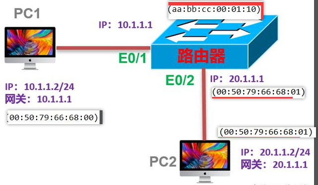

2台PC和一台路由器

PC1配置的IP为10.1.1.2/24，网关是10.1.1.1
PC2配置的IP为20.1.1.2/24，网关是20.1.1.1
PC1和PC2明显不在同一个网段
路由器E0/1接口配置为PC1的网关：10.1.1.1
路由器E0/2接口配置为 PC2的网关：20.1.1.1
测试PC1和PC2之间的报文交互
访问流程

步骤1：PC1想要给PC2发送数据，要先获取网关的MAC；

PC1已经知道PC2的IP地址(20.1.1.2)，查看这个IP地址时，发现它和自己(10.1.1.2)不在同一个网段，会把报文转发给网关处理。
PC1已经配置好网关(10.1.1.1)，所以就会尝试把报文发送给网关。但是PC1查看自己的ARP表项，发现是空的，默认情况下没有ARP表项。

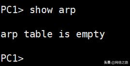

默认情况下，ARP表项是空的

PC1只有获取网关的MAC地址才能封装报文，所以它会发送ARP Request请求网关的MAC，ARP报文如下图所示：

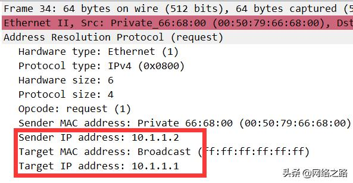

PC1请求网关的MAC

路由器收到这个ARP Request以后，发现Target IP是自己E0/1的IP地址，就会发送ARP Reply，把自己的MAC地址发送给PC1

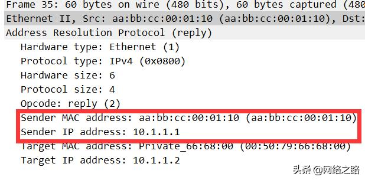

路由器回复的MAC

PC1收到ARP Reply以后，就会创建一个ARP表项，以后发送给网关的MAC都会使用这个地址来填充；

ARP表项

步骤2：PC2使用网关的MAC封装报文，发送给路由器

PC1使用网关的MAC填充报文，然后发送出去

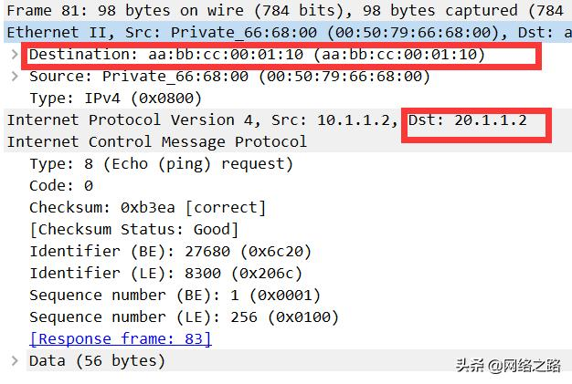

PC1发送的数据报文

目的MAC填充的是aa:bb:cc:00:01:10，这是网关的MAC
目的IP是20.1.1.2，这个是PC2的IP地址

步骤3：路由器对报文的处理：剥掉二层MAC，重新封装

路由器收到PC1发送的报文以后，会检查目的MAC地址，如果和自己的接口一样，就处理，否则丢弃；

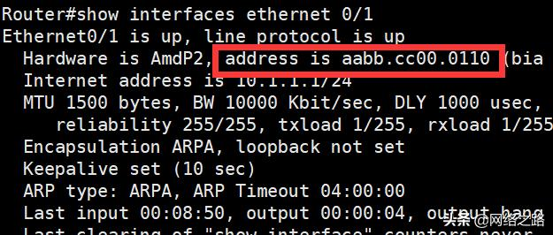

接口MAC和收到的报文MAC对比

路由器会把报文的二层信息全部剥掉，只留下三层及以上的数据；

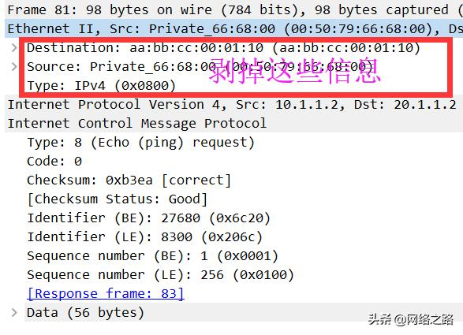

剥掉二层信息

路由器然后根据报文的目的IP地址，查找路由表，发现下一跳是出接口是E0/2；

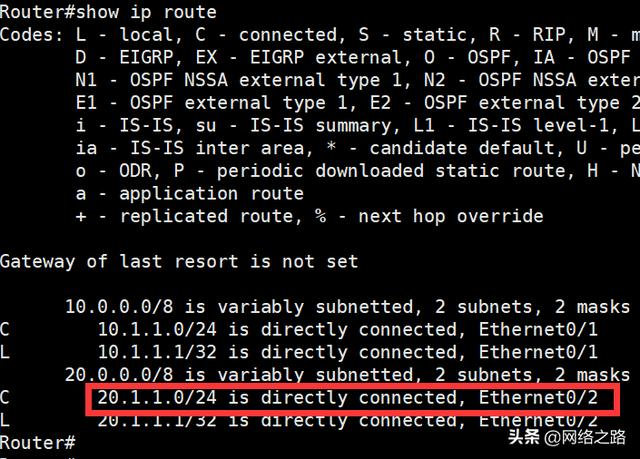

查找路由器

路由器就会使用出接口E0/2的MAC地址对之前的三层报文进行封装；

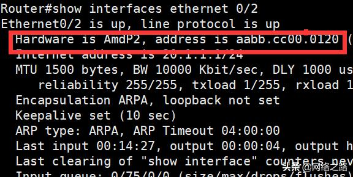

路由器E0/2MAC地址

封装完成的报文：源MAC是E0/2的MAC，目的IP地址不变，高层的ICMP内容也不变；

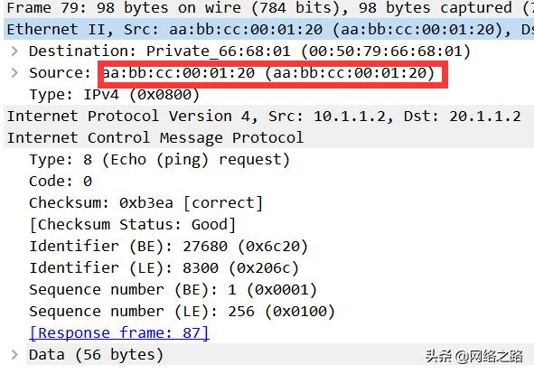

使用E0/2的MAC重新封装报文

目的MAC是PC2的MAC：路由器在发送报文给PC2之前，会发送ARP请求PC2的MAC，过程和前面类似，这里就不说了；

步骤4：PC2收到路由器发送的报文

PC2会先检查目的MAC地址，是否和自己网卡MAC相同，如果不相同， 则丢弃报文；

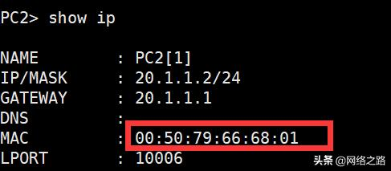

MAC地址

如果相同，则上送高层处理，然后回复ICMP，回复的ICMP的源MAC是PC2自己网卡的MAC；

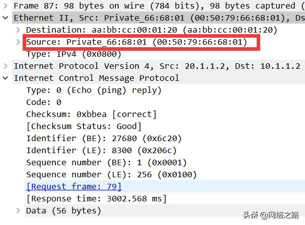

PC2回复的ARP Reply

路由器对收到的PC2的报文的处理和PC1类似，也会重新封装二层MAC信息，然后转发给PC1；

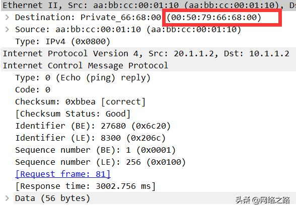

PC1收到的ARP Reply信息

总结
通过上面的描述，我们可以看出来有2个比较重要的知识点：

知识点一：对于不在同一网段的报文，PC会包报文发送给网关，由网关来处理；
知识点二：收到报文以后，路由器会先剥掉二层信息，保留三层及以上数据；在将数据发送出去时，还会对数据进行重新封装，加上新的二层信息。

# 举例

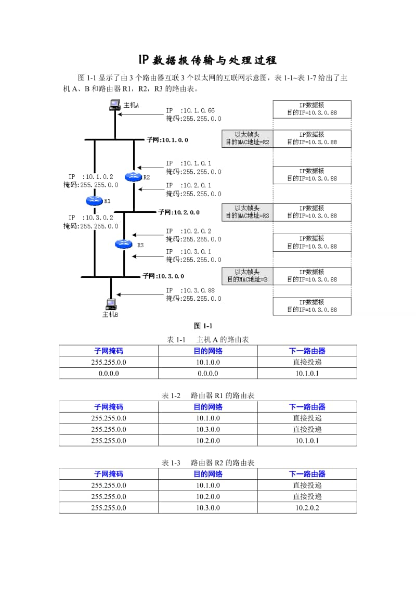

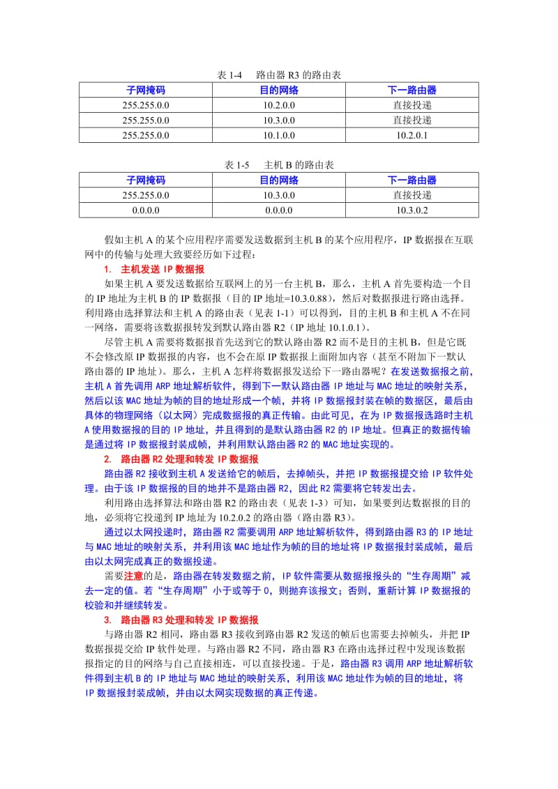

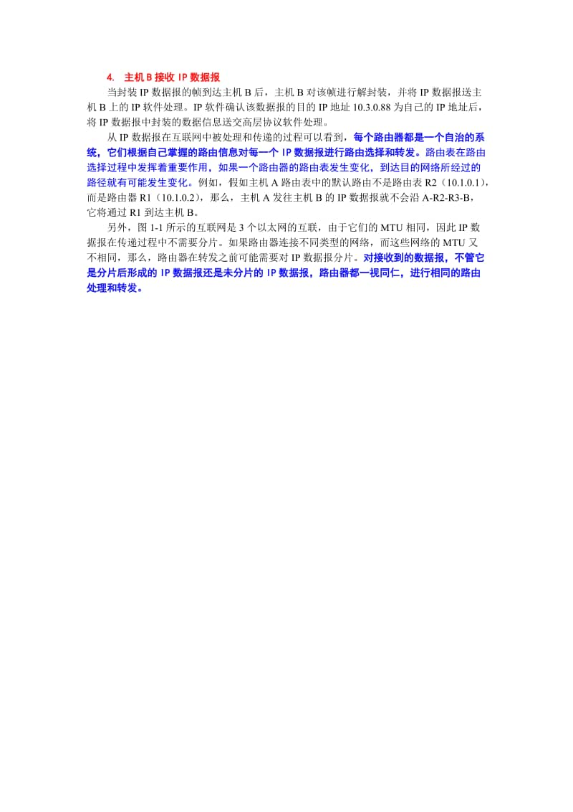